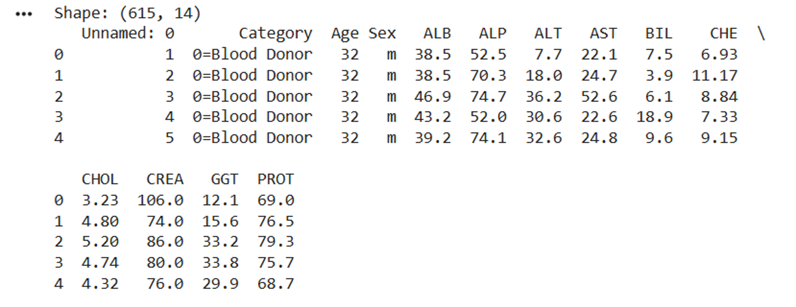

# Analisis Cluster Pasien HCV K-Means VS K-Means++  

Analisis clustering data HCV ini menggunakan dua algoritma K-Means. Proyek ini berfokus pada perbandingan performa antara K-Means (inisialisasi random) dan K-Means++ dalam mengelompokkan pasien berdasarkan parameter klinis.  

## Tujuan
- Membandingkan efektivitas K-Means VS K-Means++ pada data medis
- Menentukan jumlah klaster optimal dengan elbow method dan silhouette score
- Menganalisis karakteristik setiap cluster
- Membust Visualisasi hasil cluster dengan PCA  

# Tahapan Implementasi  
1. Load data: Membaca dan inspeksi dataset awal
2. Preprocesing:   
- encoding variabel
- menemukan missing value
- standarisasi fitur numerik  
3. Analisis cluster:  
- Elbow Method  
- Silhouette score  
4. clustering:  
- K-means dengan random initialization  
- K-Means++ dengan smart initialization  
5. Evaluasi: MSE (Mean Squared Error)  
6. Visualisasi: PCA  

# Fitur Utama
- Perbandingan lengkap dua metode K-Means dalam satu eksekusi
- Validasi ganda menggunakan Elbow method dan Silhouette Score
- Output terstruktur dengan tabel dan statistik
- PCA yang terpisah untuk setiap metode  

## Dataset  
  
  

Dataset terdiri dari 14 kolom dan 615 sampel, dengan beberapa tipe, yaitu integer, categorical, dan continous.  

## Missing Value  
  

Terdapat beberapa missing value yang terdapat pada dataset, pada kolom ALB terdapat 1 missing value, ALP terdapat 18 missing value, ALT terdapat 1 missing value, CHOL terdapat 10 missing value, dan PROT terdapat 1 missing value.  

## Elbow Method dan Silhouette Score  
### Elbow Method dan Silhouette Score K-Means  
  

### Elbow Method dan Silhouette Score K-Means++  
   

## Hasil clustering  
### Hasil cluster K-Means  
  
  

### Hasil Cluster K-Means++  
  
   

## Evaluasi  
### MSE K-Means  
  

### MSE K-Means++  
  

## Visualisasi PCA  
### PCA K-Means  
  

### PCA K-Means++  
  

## Link Dataset  
https://archive.ics.uci.edu/dataset/571/hcv+data

# Catatan  
**Kode ini dibuat hanya untuk pembelajaran**

